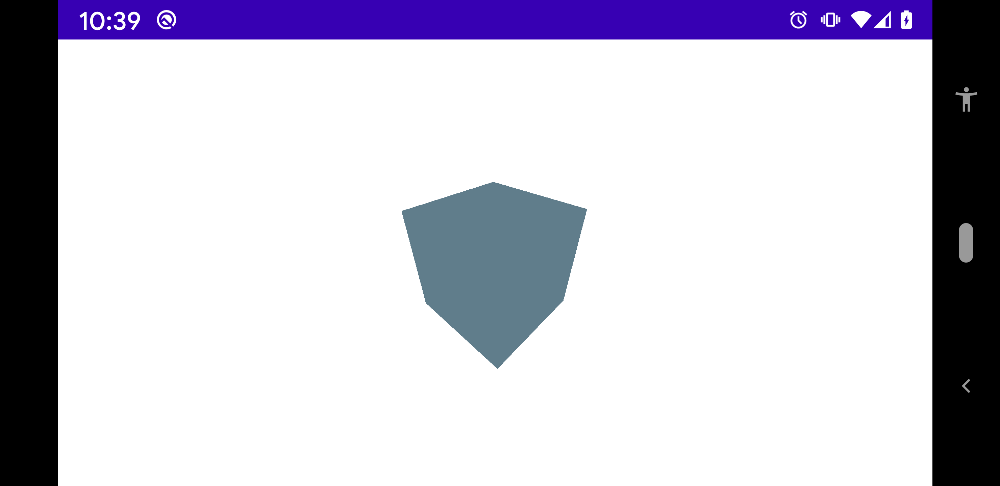
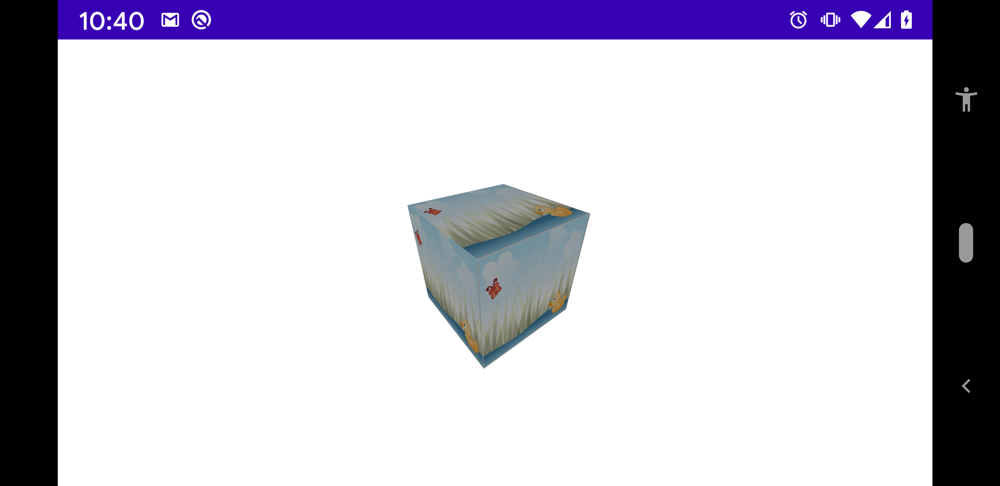
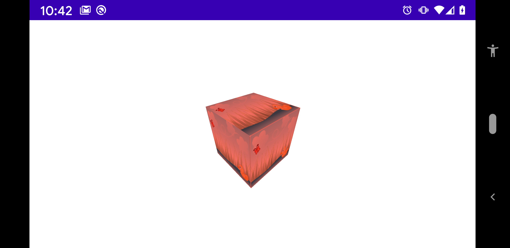

# Material

A [fr.jhelp.engine.scene.Material](../../main/java/fr/jhelp/engine/scene/Material.kt) describes the decoration
of an object. It can be a color, an image (called texture) or combination of both.

A [Material](../../main/java/fr/jhelp/engine/scene/Material.kt) can be shared by several objects.

1. [Diffuse](#diffuse)
1. [Texture](#texture)
1. [Texture and diffuse](#texture-and-diffuse)

### Diffuse

By default objects have their own grey material, that's why in [Hello world](../helloWorld/HelloWorld.md)
the box is grey.

To change the color, just change the diffuse:
````kotlin
package fr.jhelp.multitools.tutorial

import android.app.Activity
import android.os.Bundle
import fr.jhelp.engine.scene.BLUE_GREY
import fr.jhelp.engine.scene.geom.Box
import fr.jhelp.engine.view.View3D
import fr.jhelp.multitools.R
import fr.jhelp.tasks.parallel

/**
 * Hello world tutorial
 */
class DiffuseMaterialActivity : Activity()
{
    override fun onCreate(savedInstanceState: Bundle?)
    {
        super.onCreate(savedInstanceState)
        this.setContentView(R.layout.activity_main)
        // Get the 3D view and draw it in independent thread to free the UI thread
        parallel(this.findViewById(R.id.view3D), this::drawScene)
    }

    /**
     * Draw scene on 3D view
     */
    private fun drawScene(view3D: View3D)
    {
        // Get scene in 3D view
        val scene3D = view3D.scene3D
        // Position the root node in front of the camera to able see the scene
        scene3D.root.position.z = -2f
        // Create a box
        val box = Box()
        // Add box to the scene
        scene3D.root.add(box)

        // Change material diffuse
        box.material.diffuse = BLUE_GREY
    }
}
```` 
Will make the box blue/grey:


The color is a [fr.jhelp.engine.scene.Color3D](../../main/java/fr/jhelp/engine/scene/Color3D.kt).
You can use predefined one or create your own.

### Texture

To put a texture in a object 3D :

````kotlin
package fr.jhelp.multitools.tutorial

import android.app.Activity
import android.os.Bundle
import fr.jhelp.engine.resources.ResourcesAccess
import fr.jhelp.engine.scene.geom.Box
import fr.jhelp.engine.view.View3D
import fr.jhelp.multitools.R
import fr.jhelp.tasks.parallel

/**
 * Hello world tutorial
 */
class TextureMaterialActivity : Activity()
{
    override fun onCreate(savedInstanceState: Bundle?)
    {
        super.onCreate(savedInstanceState)
        this.setContentView(R.layout.activity_main)
        // Get the 3D view and draw it in independent thread to free the UI thread
        parallel(this.findViewById(R.id.view3D), this::drawScene)
    }

    /**
     * Draw scene on 3D view
     */
    private fun drawScene(view3D: View3D)
    {
        // Get scene in 3D view
        val scene3D = view3D.scene3D
        // Position the root node in front of the camera to able see the scene
        scene3D.root.position.z = -2f
        // Create a box
        val box = Box()
        // Add box to the scene
        scene3D.root.add(box)

        // Change material texture
        box.material.texture = ResourcesAccess.obtainTexture(R.drawable.default_screen)
    }
}
````

And do:


[ResourcesAccess](../../main/java/fr/jhelp/engine/resources/ResourcesAccess.kt) is usable only if theire at leat one [View3D](../../main/java/fr/jhelp/engine/view/View3D.kt)
on the current activity.

Look at [Texture](../../main/java/fr/jhelp/engine/scene/Texture.kt) to have other ways to create a texture.
More about [Texture](../../main/java/fr/jhelp/engine/scene/Texture.kt) at : [Textures](Texture.md)

By default, box draw the texture on each face. It's possible to change this behavior. See [Box detils](../scene/box/Box.md)

### Texture and diffuse

Combine diffuse and texture, have effect like texture is tint by the diffuse.
Often use the `WHITE` color to make texture brighter.

Here example with light red:
````kotlin
package fr.jhelp.multitools.tutorial

import android.app.Activity
import android.os.Bundle
import fr.jhelp.engine.resources.ResourcesAccess
import fr.jhelp.engine.scene.LIGHT_RED
import fr.jhelp.engine.scene.geom.Box
import fr.jhelp.engine.view.View3D
import fr.jhelp.multitools.R
import fr.jhelp.tasks.parallel

/**
 * Hello world tutorial
 */
class TextureAndDiffuseMaterialActivity : Activity()
{
    override fun onCreate(savedInstanceState: Bundle?)
    {
        super.onCreate(savedInstanceState)
        this.setContentView(R.layout.activity_main)
        // Get the 3D view and draw it in independent thread to free the UI thread
        parallel(this.findViewById(R.id.view3D), this::drawScene)
    }

    /**
     * Draw scene on 3D view
     */
    private fun drawScene(view3D: View3D)
    {
        // Get scene in 3D view
        val scene3D = view3D.scene3D
        // Position the root node in front of the camera to able see the scene
        scene3D.root.position.z = -2f
        // Create a box
        val box = Box()
        // Add box to the scene
        scene3D.root.add(box)

        // Change material diffuse and texture
        box.material.diffuse = LIGHT_RED
        box.material.texture = ResourcesAccess.obtainTexture(R.drawable.default_screen)
    }
}
````


