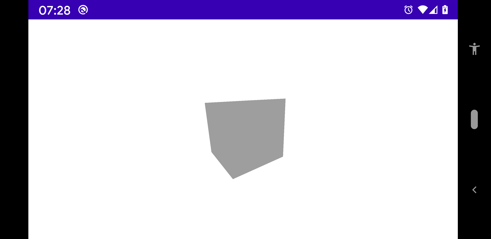

# Hello world 

1. [First step : add the 3D view](#first-step--add-the-3d-view)
1. [Second step : add something in 3D view](#second-step--add-something-in-3d-view)

In this tutorial we will see how create a view with 3D and how add things in it.

### First step : add the 3D view

To add a view with 3D in your Activity or Fragment, add a [fr.jhelp.engine.view.View3D](../../main/java/fr/jhelp/engine/view/View3D.kt).
Its possible to have several `View3D` in same interface.

By example in layout XML :
````XML
<?xml version="1.0" encoding="utf-8"?>
<androidx.constraintlayout.widget.ConstraintLayout xmlns:android="http://schemas.android.com/apk/res/android"
    xmlns:app="http://schemas.android.com/apk/res-auto"
    xmlns:tools="http://schemas.android.com/tools"
    android:layout_width="match_parent"
    android:layout_height="match_parent"
    tools:context=".MainActivity">

    <!-- Place the 3D view -->
    <fr.jhelp.engine.view.View3D
        android:id="@+id/view3D"
        android:layout_width="0dp"
        android:layout_height="0dp"
        app:layout_constraintLeft_toLeftOf="parent"
        app:layout_constraintRight_toRightOf="parent"
        app:layout_constraintTop_toTopOf="parent"
        app:layout_constraintBottom_toBottomOf="parent"
        />

</androidx.constraintlayout.widget.ConstraintLayout>
````

Then in your Activity:
````kotlin
package fr.jhelp.multitools.tutorial

import android.app.Activity
import android.os.Bundle
import fr.jhelp.engine.view.View3D
import fr.jhelp.multitools.R
import fr.jhelp.tasks.parallel

/**
 * Hello world tutorial
 */
class HelloWorldActivity : Activity()
{
    override fun onCreate(savedInstanceState: Bundle?)
    {
        super.onCreate(savedInstanceState)
        this.setContentView(R.layout.activity_main)
        // Get the 3D view and draw it in independent thread to free the UI thread
        parallel(this.findViewById(R.id.view3D), this::drawScene)
    }

    /**
     * Draw scene on 3D view
     */
    private fun drawScene(view3D: View3D)
    {
    }
}
````

Like this it will draw a white rectangle, since nothing is draw on the 3D view.

Add/modify things in 3D view can be done from any thread, that's why we launch it in independent thread.
We free the UI thread and not take the risk to slow it or cause an ANR.

### Second step : add something in 3D view

[fr.jhelp.engine.view.View3D](../../main/java/fr/jhelp/engine/view/View3D.kt) contains a [fr.jhelp.engine.view.Scene3D](../../main/java/fr/jhelp/engine/scene/Scene3D.kt).

[Scene3D](../../main/java/fr/jhelp/engine/scene/Scene3D.kt) represents the scene graph. In top of it their a root, 
where all objects will be attach.

To get it :

````kotlin
    /**
     * Draw scene on 3D view
     */
    private fun drawScene(view3D: View3D)
    {
        // Get scene in 3D view
        val scene3D = view3D.scene3D
        // Position the root node in front of the camera to able see the scene
        scene3D.root.position.z = -2f
    }
````

By default the manipulated node (by drag on the screen) is the scene root.
To be able see future thinks we put on it, we just put the root in front of camera.

For have something to see, we will use a prebuilt object : [fr.jhelp.engine.scene.geom.Box](../../main/java/fr/jhelp/engine/scene/geom/Box.kt)
that represents a box.

````kotlin
        // Create a box
        val box = Box()
        // Add box to the scene
        scene3D.root.add(box)
````

We have add the box to the root's scene for draw it.

So final code :

````kotlin
package fr.jhelp.multitools.tutorial

import android.app.Activity
import android.os.Bundle
import fr.jhelp.engine.scene.geom.Box
import fr.jhelp.engine.view.View3D
import fr.jhelp.multitools.R
import fr.jhelp.tasks.parallel

/**
 * Hello world tutorial
 */
class HelloWorldActivity : Activity()
{
    override fun onCreate(savedInstanceState: Bundle?)
    {
        super.onCreate(savedInstanceState)
        this.setContentView(R.layout.activity_main)
        // Get the 3D view and draw it in independent thread to free the UI thread
        parallel(this.findViewById(R.id.view3D), this::drawScene)
    }

    /**
     * Draw scene on 3D view
     */
    private fun drawScene(view3D: View3D)
    {
        // Get scene in 3D view
        val scene3D = view3D.scene3D
        // Position the root node in front of the camera to able see the scene
        scene3D.root.position.z = -2f
        // Create a box
        val box = Box()
        // Add box to the scene
        scene3D.root.add(box)
    }
}
````

Do :


Move your finger in the screen to rotate the scene.