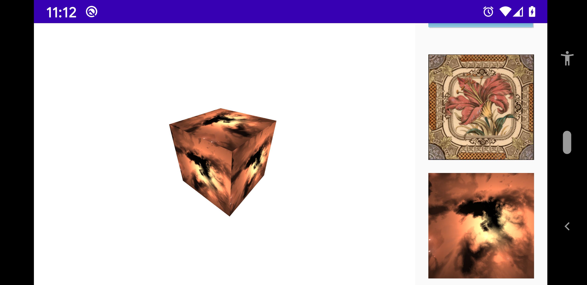

# Box

A box is made of 6 faces 

Default constructor of [Box](../../../main/java/fr/jhelp/engine/scene/geom/Box.kt) `Box()` will apply complete texture on each face.

But we can specify a [BoxUV](../../../main/java/fr/jhelp/engine/scene/geom/BoxUV.kt) at construction.
This object describes for each fac of the box the part of the texture to take. 
The object that describes a face is a [FaceUV](../../../main/java/fr/jhelp/engine/scene/geom/FaceUV.kt).
It specify a rectangle inside the texture in percentage of size, so the texture size have no importance, we take exactly the same portion.
If more than 1 value can do repetition. 

[CrossUV](../../../main/java/fr/jhelp/engine/scene/geom/CrossUV.kt) is a `BoxUV' for simplify face definition if texture is used like a cross. 
Like 

