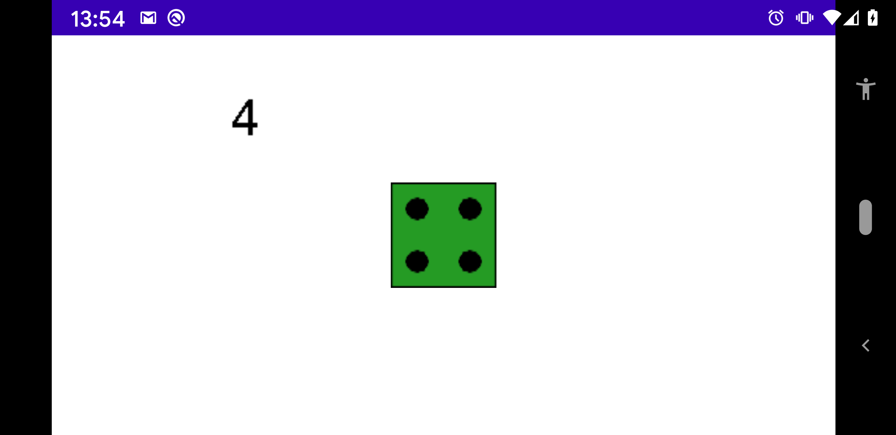

# Dice

[Dice](../../../main/java/fr/jhelp/engine/scene/geom/dice/Dice.kt) represents a classical 6 faces dice.

Its possible to change dice color with `color` method.

Method `value` create an animation to put dice to a specific value. More about [animations](../../animations/Animations.md)

Method `roll` create an animation to roll the value and take a random value at the end. More about [animations](../../animations/Animations.md)

To react when a new dice value is set, it have methods to observe the value. See [observable](../../../../../tasks/src/doc/Observable.md)
 
