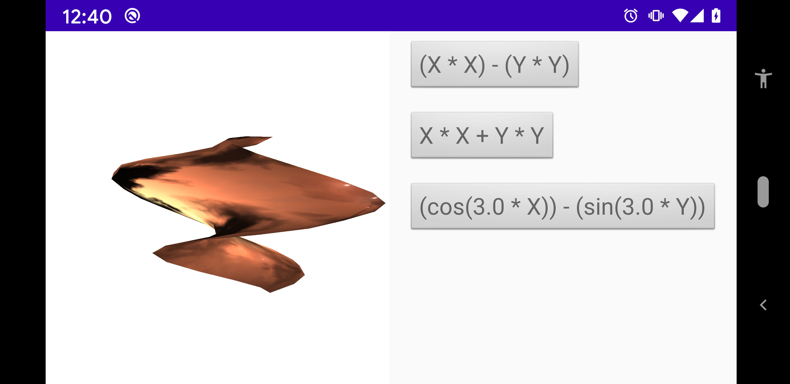

# Field

A [Field](../../../main/java/fr/jhelp/engine/scene/geom/Field3D.kt) represents a terrain defines by equation  Z = f(X, Y)

By example 

```kotlin
import fr.jhelp.engine.scene.geom.Field3D

import fr.jhelp.utilities.formal.X
import fr.jhelp.utilities.formal.Y
import fr.jhelp.utilities.formal.cos
import fr.jhelp.utilities.formal.minus
import fr.jhelp.utilities.formal.sin
import fr.jhelp.utilities.formal.times

// ...

    val field = Field3D(cos(3 * X) - sin(3 * Y),
                        -1f, 1f, 10,
                        -1f, 1f, 10)
``` 



The function must depends only on X and/or Y. 
It can be a constant value, but a [Plane](../plane/Plane.md) is more efficient

To actual have possible function construction see [Mathematical function](../../../../../utilities/src/doc/formal/Formal.md)

