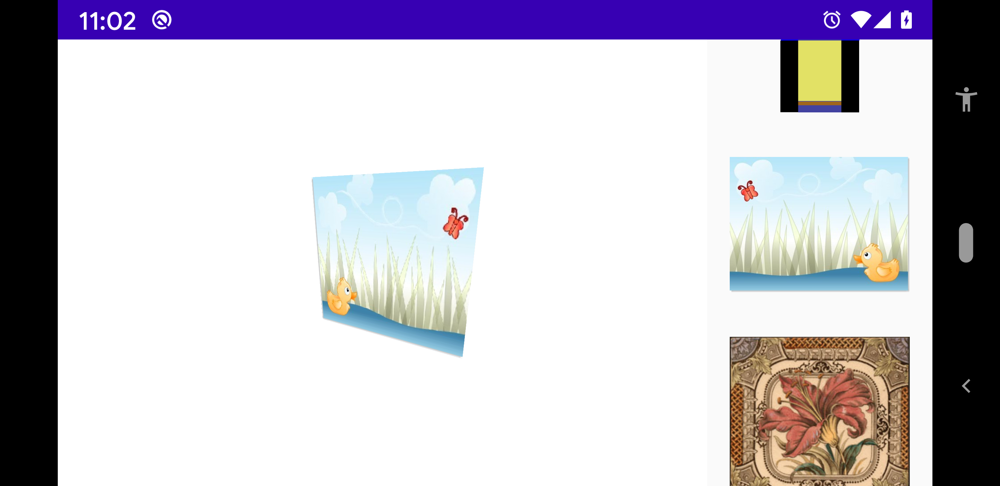
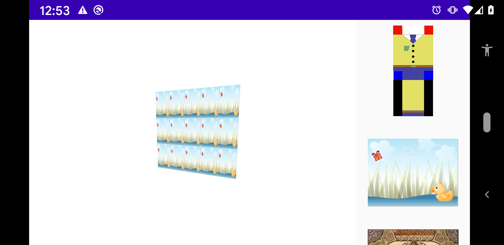

# Plane

A [fr.jhelp.engine.scene.geom.Plane](../../../main/java/fr/jhelp/engine/scene/geom/Plane.kt) 
is a part of a plane delimited by a rectangle. 
It is a sealed [Object3D](../../../main/java/fr/jhelp/engine/scene/Object3D.kt) with 2 faces.



To create a plane:

````kotlin
import fr.jhelp.engine.scene.geom.Plane

// ...

val plane = Plane()
````

By default, an applied [Texture](../../../main/java/fr/jhelp/engine/scene/Texture.kt) 
takes the all [Plane](../../../main/java/fr/jhelp/engine/scene/geom/Plane.kt).

I's possible to get only a part on specify : `startU`, `endU`, `startV`, `endV` on constructor.

By specify values more than one, it can repeat the texture horizontally and /or vertically:

 ````kotlin
 import fr.jhelp.engine.scene.geom.Plane
 
 // ...
 
 val plane = Plane(0f, 5f, 0f, 3f)
 ````



