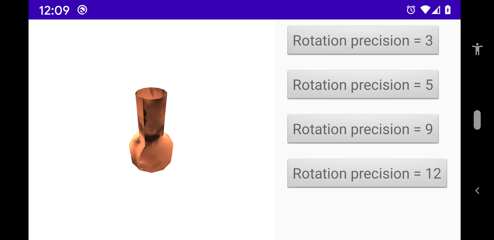

# Revolution

A [Revolution](../../../main/java/fr/jhelp/engine/scene/geom/Revolution.kt) it a path defines in (X, Y) plane the rotated around Y axis.

Path are defined with [Path](../../../../../images/src/main/java/fr/jhelp/images/path/Path.kt)

For example :

```kotlin
        val path = Path()
        path.moveTo(0.25f, 1f)
        path.lineTo(0.25f, 0f)
        path.quadraticTo(0.5f, 0f, 0.5f, -0.25f)
        path.lineTo(0.5f, -0.5f)
        path.lineTo(0f, -0.5f)

        val revolution = Revolution(path, pathPrecision = 10, rotationPrecision = 16)
        revolution.doubleFace = true
```


 
We recommend construct path from maximum Y to minimum (like in example). Simple continues "line".
Remember X positives values will be mirrored in negative due the rotation. 

