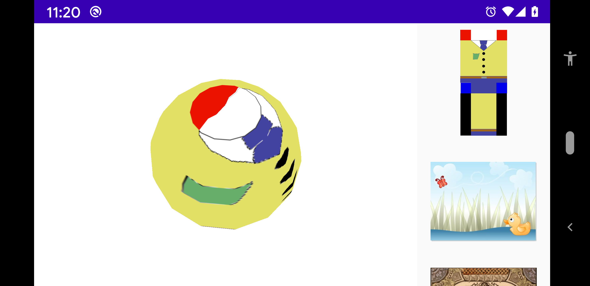

# Sphere

[Sphere](../../../main/java/fr/jhelp/engine/scene/geom/Sphere.kt) looks like a ball or planet.

By slice and stack parameters default parameters are set to be a good compromise of look round, render speed and memory usage.

Slice is the number of meridians (longitude)  for define the sphere. Between 2 and 32, default 16. 
For values less than 12, round look is lost but can be used for create some other shape.
For values more 16, round look is better, but keep in mind that memory cost and render time may implies if have to draw several spheres

Stack is the number of parallel (latitude) for define the sphere. Between 2 and 32, default 16. 
For values less than 12, round look is lost but can be used for create some other shape.
For values more 16, round look is better, but keep in mind that memory cost and render time may implies if have to draw several spheres
                                           
Textures are completely applied aound sphere by default, but it can be a part or repetition of change default value (1) for U or V multipliers.
