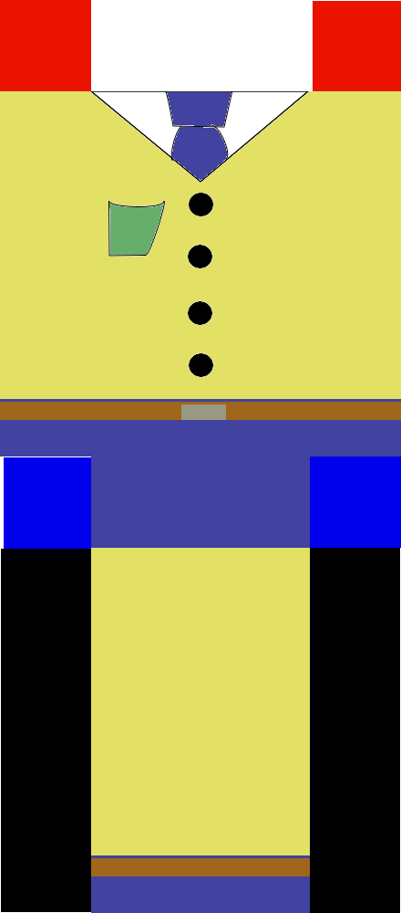
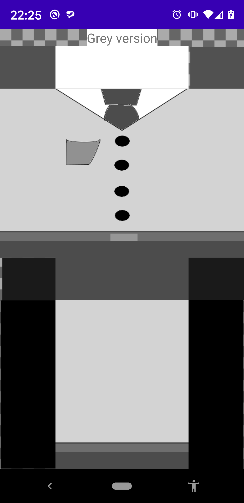
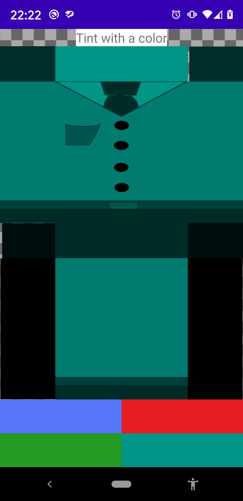
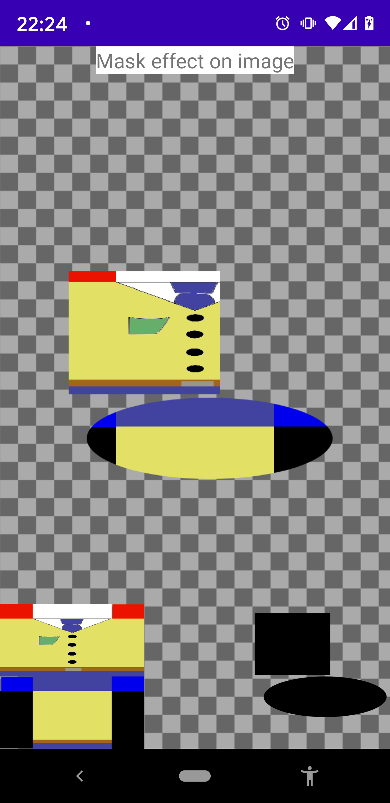
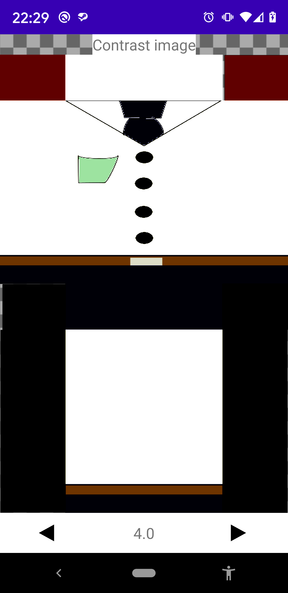
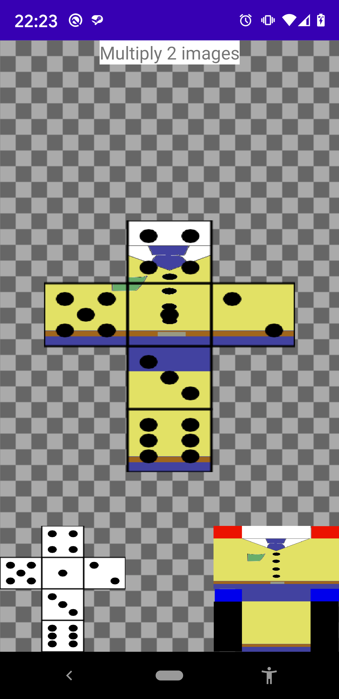
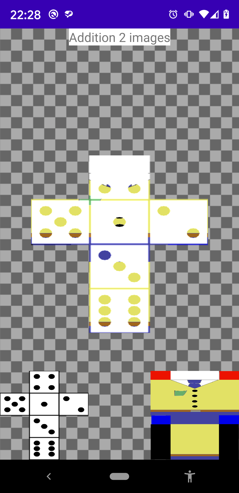
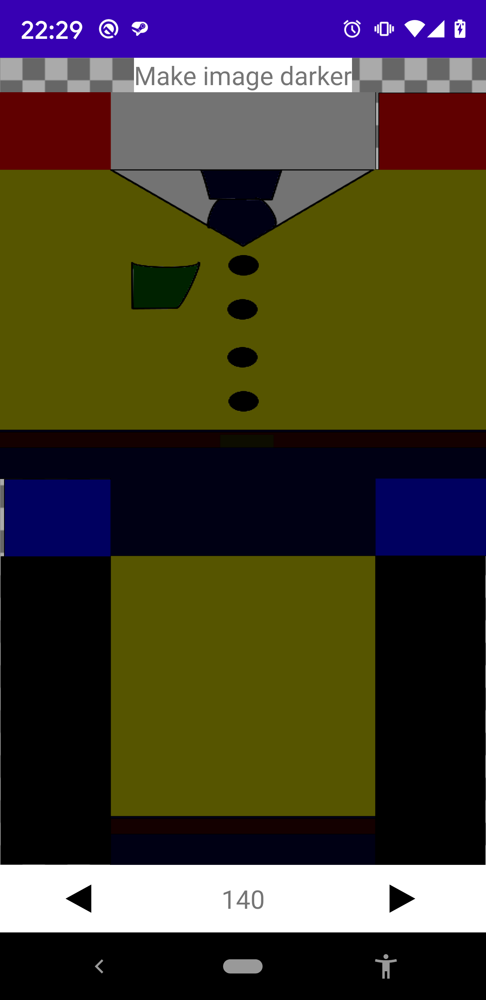
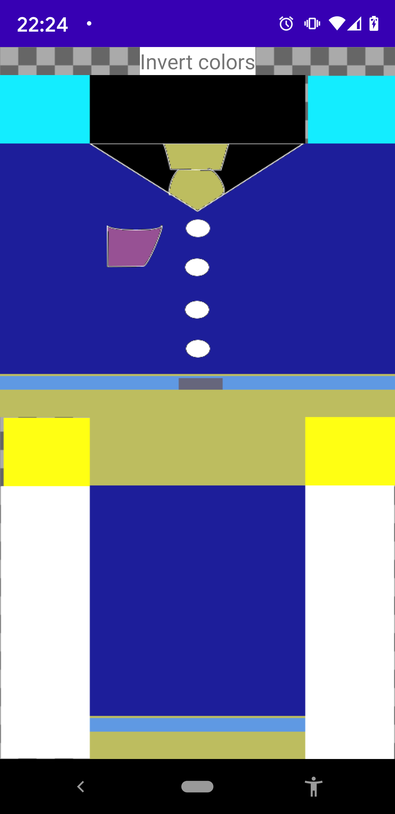
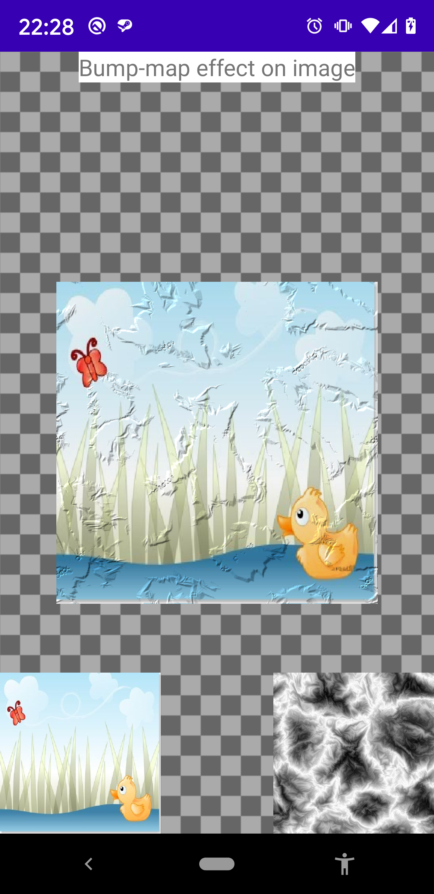

# Images manipulation

This module is dedicated to image manipulation.

1. [Canvas extensions](#canvas-extensions)
1. [Bitmap extensions](#bitmap-extensions)
    1. [clear extension](#clear-extension)
    1. [grey extension](#grey-extension)
    1. [tint extension](#tint-extension)
    1. [mask extension](#mask-extension)
    1. [shift extension](#shift-extension)
    1. [copy extension](#copy-extension)
    1. [contrast extension](#contrast-extension)
    1. [multiply extension](#multiply-extension)
    1. [add extension](#add-extension)
    1. [darker extension](#darker-extension)
    1. [invertColors extension](#invertcolors-extension)
    1. [pixelsOperation extension](#pixelsoperation-extension)
    1. [createBumped function](#createbumped-function)
1. [Path and segments](#path-and-segments) 

### Canvas extensions

In [Canvas.kt](../main/java/fr/jhelp/images/Canvas.kt) their defined some extensions for `android.graphics.Canvas`

`neonLine` : Draw a segment in canvas with neon effect. 
The neon base color is given by the given `Paint` color.
The `thin` is a neon effect thin, 15 seems a good minimal value.

`bitmap` : Short cut for draw a bitmap. 
The up left corner of the bitmap will be locate at given position.

`center` : Short cut for draw a bitmap.
The center of the bitmap will be locate at given position

`repeatOnLine` : Repeat a bitmap along a segment.

### Bitmap extensions

In [Images.kt](../main/java/fr/jhelp/images/Images.kt) their defined some extensions for `android.graphics.Bitmap`
and some other utilities.

To convert RGB to YUV (or reverse), six methods exists :
* `computeBlue`: Compute Blue part in RGB from YUV information
* `computeGreen`: Compute Green part in RGB from YUV information
* `computeRed`: Compute Red part in RGB from YUV information
* `computeY` : Compute Y part in YUV from RGB information
* `computeU` : Compute U part in YUV from RGB information
* `computeV` : Compute V part in YUV from RGB information

##### clear extension

`clear`  extension on `android.graphics.Bitmap` fill the all bitmap with given color.
Alpha of given color are respected.

##### grey extension

`grey` extension on `android.graphics.Bitmap`, transform image to its grey version.
By example it transform:

To 

##### tint extension

`tint` extension on `android.graphics.Bitmap`, tint image with given color.
By example it transform:

To 

##### mask extension

`mask` extension on `android.graphics.Bitmap`, copy alpha of mask in the bitmap.
By example 

##### shift extension

`shift` extension on `android.graphics.Bitmap`, translate bitmap pixels

##### copy extension

`copy` extension on `android.graphics.Bitmap`, copy given bitmap pixels to this bitmap.
Sizes must be the same

###### contrast extension

`contrast` extension on `android.graphics.Bitmap`, change bitmap contrast:

###### multiply extension

`multiply` extension on `android.graphics.Bitmap`, multiply given bitmap pixels to this pixels.
Sizes must be the same

###### add extension

`add` extension on `android.graphics.Bitmap`, add given bitmap pixels to this pixels.
Sizes must be the same

###### darker extension

`darker` extension on `android.graphics.Bitmap`, make bitmap darker:

##### invertColors extension

`invertColors` extension on `android.graphics.Bitmap`, invert image pixels color
By example it transform:

To 

###### pixelsOperation extension

Shortcut for manipulate a Bitmap pixels.

It does:
1. Extracts bitmap pixels
1. Give pixels to the given operation that do their modifications
1. Update bitmap pixels with modified pixels

##### createBumped function

`createBumped` method create bumpmap effect on given source using the bump for the effect.

### Path and segments

A path is can be composed of segments and/or quadratics and/or cubics and/or elliptic arcs.

Path is not necessary continuous, and a part of it can be easily closed.

Methods for create the path :
* `moveTo` Defines a starting of a new part. The point become the start and the end point 
* `lineTo` Add a segment from last end point to given point. The given point becomes the new end point
* `quadraticTo` Add a quadratic from last end point, using control point and finish to a given point. 
   The ending given point becomes the new end point 
* `cubicTo` Add a cubic from last end point, using controls points and finish to a given point. 
   The ending given point becomes the new end point
* `ellipticArcTo` Add an elliptical arc.  The ending given point becomes the new end point
* `close` Close the current part on adding a line form current end point to last defined start point.
  The start pooint becomes also the end point.
  
The method `path`, approximates the path by a list of segments. 
The size and the number of segments depends on precision request. 
More the precision is high, more result is smooth, but more segments are generated.

The method `path` ask two numbers. They will be homogeneously interpolated along generated segments.
The start value will be affected on the start of first segment.
The end value will be affected on the end of last segment.
  

